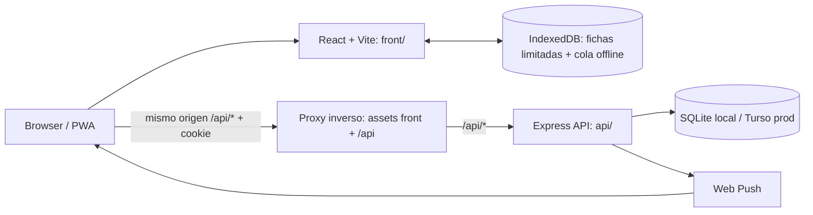

# Especificación técnica: API compartida para Medice

| Campo                    | Valor                                                                                                                     |
| ------------------------ | ------------------------------------------------------------------------------------------------------------------------- |
| Estado                   | Contratos de datos, permisos, búsqueda, alertas, métricas y edición precisados; decisiones de producto confirmadas en FRS |
| Autor                    | Codex, a partir del repositorio, el functional spec aprobado y las decisiones del usuario                                 |
| Creada                   | 2026-09-20                                                                                                                |
| Actualizada              | 2026-09-21                                                                                                                |
| Especificación funcional | [functional-spec.md](./functional-spec.md)                                                                                |
| Relacionados             | `AGENTS.md`, `api/AGENTS.md`, `api/docs/ARCHITECTURE.md`, `api/README.md`                                                 |

## Resumen

Medice se ejecutará como dos aplicaciones dentro del monorepo: React/Vite en `front/` y Express/TypeScript en `api/`. Por decisión del usuario, estarán en el mismo origen público: un proxy inverso servirá los assets del frontend y reenviará `/api/*` al proceso API. En desarrollo, Vite hará el proxy equivalente al proceso API local. El API usará SQLite local para desarrollo y Turso en producción.

Se extenderá la arquitectura hexagonal del scaffold para el dominio Medice; no se migrarán páginas clínicas al dominio genérico de ejemplo. La sesión del navegador será una cookie opaca de servidor con `HttpOnly`, `Secure`, `SameSite=Lax` y protección CSRF, en lugar de exponer JWT al JavaScript del frontend. Los seguimientos offline se guardarán en IndexedDB con una clave de idempotencia y se reintentarán hasta que la API los confirme.

**Complejidad:** Alta. Incluye sesiones seguras, nuevos modelos y migraciones, permisos, integración de todas las páginas, almacenamiento offline explícito, reintentos idempotentes y notificaciones push.

**Infraestructura (v1):** SQLite local + Turso productivo, confirmados por el usuario; la validación de Turso queda fuera de este plan. Frontend y API comparten el mismo origen público con `/api` detrás de proxy. El proveedor concreto del host queda abierto.

## Principios de ingeniería aplicados

| Principio                       | Aplicación                                                                                                                                                        |
| ------------------------------- | ----------------------------------------------------------------------------------------------------------------------------------------------------------------- |
| API autoridad                   | La autorización y las reglas de escritura viven en Express; esconder acciones en React no es un control de acceso.                                                |
| Límites actuales del scaffold   | Rutas/controladores adaptan HTTP; servicios aplican reglas; repositorios y migraciones encapsulan la persistencia; `container.ts` compone dependencias.           |
| Privacidad por diseño           | El push no incluye identidad ni motivo clínico; el service worker no almacena respuestas protegidas; la caché offline se limita a asignados previamente abiertos. |
| Seguridad de sesión             | Cookie de sesión no accesible a JavaScript, validación CSRF en mutaciones y revocación en servidor. No persistir identificadores de sesión en `localStorage`.     |
| Sincronización reintentable     | Cada seguimiento offline conserva un ID cliente estable; la API acepta reintentos sin crear duplicados.                                                           |
| Adopción gradual por verticales | Auth, lectura, escritura, offline y push se integran en cortes completos API + UI con criterios del functional spec.                                              |

Para el intercambio de sesión se usará una cookie `__Host-medice_session` con `Secure`, `HttpOnly`, `SameSite=Lax` y `Path=/`, sin atributo `Domain`. Esta estrategia fue confirmada por el usuario el 2026-09-20. `SameSite` es una defensa adicional: las acciones mutables también validan un token CSRF y el origen. Estas recomendaciones siguen las guías de [OWASP Session Management](https://cheatsheetseries.owasp.org/cheatsheets/Session_Management_Cheat_Sheet.html), [OWASP HTML5 Security](https://cheatsheetseries.owasp.org/cheatsheets/HTML5_Security_Cheat_Sheet.html) y [MDN Secure cookie configuration](https://developer.mozilla.org/en-US/docs/Web/Security/Practical_implementation_guides/Cookies).

Cada mutación autenticada requiere un `Origin` explícito que coincida con el origen de la solicitud o con uno configurado en `CLIENT_URL`, además del token CSRF de doble envío. Una petición sin `Origin` se rechaza aunque presente una cookie CSRF coincidente. Al cerrar sesión se revocan la sesión server-side y ambas cookies (sesión y CSRF). Producción usa las cookies `__Host-` seguras; desarrollo local usa nombres sin prefijo `__Host-` para permitir HTTP.

El middleware HTTP del producto solo acepta sesiones de navegador emitidas por la API; un `Authorization: Bearer` sin cookie de sesión no autentica solicitudes clínicas. Los endpoints de email/password del scaffold están ocultos salvo que `EMAIL_AUTH_ENABLED=true`; el entorno Medice los mantiene desactivados. El bypass de desarrollo/E2E falla al iniciar si se configura con `NODE_ENV=production`.

En el intercambio del código Google del popup, el front envía `X-Requested-With: XmlHttpRequest` y la API rechaza la petición si falta o difiere; Google lo documenta como verificación CSRF para el modo popup. La API verifica el ID token contra el client ID cargado por configuración, exige `email_verified=true` y normaliza el correo antes de aplicar la allow-list. Los E2E locales pueden habilitar `TEST_GOOGLE_AUTH=true` únicamente junto con `NODE_ENV=test`; el fake no se evalúa en otros entornos.

## Arquitectura

### Aplicaciones y límites

- **Frontend (`front/`)**: presentación, navegación, formularios, estados async, caché offline explícita, outbox de seguimientos y registro de suscripciones push.
- **API (`api/`)**: OAuth Google, lista autorizada, roles y permisos, datos canónicos, auditoría de cambios, estadísticas y dispatch de alertas.
- **Datos**: las tablas clínicas se agregan a las migraciones Knex del API. Los usuarios, roles, notificaciones, suscripciones y eventos de auditoría reutilizan los cimientos del scaffold cuando su semántica coincide.
- **Fuera del dominio**: `ExampleItem` no se reutiliza como entidad clínica; el manejo genérico de media no se conecta a fichas médicas en esta entrega.
- **Empaquetado local/mismo origen**: el `Dockerfile` raíz compila `front/` y `api/` en etapas separadas. Con `FRONT_DIST_DIR`, Express sirve la SPA y reenvía naturalmente las rutas `/api` al router; fallback SPA permite refresh/rutas directas. Vite mantiene su proxy solo en desarrollo.

### Flujo de una solicitud

1. El browser solicita la SPA al origen público.
2. La SPA llama a rutas relativas `/api/...`; el navegador adjunta la cookie de sesión y un encabezado CSRF en operaciones mutables.
3. El middleware resuelve usuario y permisos. El controlador valida el límite HTTP y llama al servicio del dominio.
4. El servicio valida relaciones y reglas, persiste mediante repositorios y registra auditoría en operaciones administrativas sensibles.
5. El controlador devuelve la representación estable del recurso. El frontend actualiza la vista solo tras confirmación.

## Sesión y autorización

### Inicio y renovación

- Se mantiene el flujo Google del scaffold (`POST /api/auth/google`) y la comprobación de correo autorizado.
- El API crea una sesión opaca aleatoria; guarda su hash y expiración en `auth_sessions`; devuelve identidad/permisos y establece `__Host-medice_session`.
- `GET /api/auth/me` devuelve el usuario y permisos de la sesión actual. Un endpoint de CSRF entrega un token asociado a la sesión para las solicitudes mutables.
- El API rota la sesión al autenticar/renovar e invalida en la siguiente solicitud las sesiones de cuentas que salen de allow-list o cambian a un rol con menos permisos; logout revoca la sesión activa.
- `POST /api/auth/signout` invalida la sesión en base y limpia la cookie. La interfaz no persiste tokens de acceso ni refresh tokens en Web Storage.
- `INITIAL_ADMIN_EMAILS` contiene los correos de bootstrap inicial. Los normaliza y autoriza; al primer login crea/asigna rol administrador. El rol queda persistido en base y la variable no debe reescribir cambios de rol posteriores. El verificador de identidad de test y cualquier bypass de desarrollo no pueden arrancar en producción.
- El login v1 usa Google Identity Services OAuth authorization-code en modo popup (`ux_mode: popup`), sin callback de redirect propio. La aplicación exige `X-Requested-With: XmlHttpRequest` en el intercambio y el servidor intercambia el código y verifica el ID token con la librería oficial de Google: firma, issuer, audience, expiración y `email_verified`. En este contrato popup no se implementan state/nonce de redirect ni PKCE de aplicación; si se cambia a redirect, deberá añadirse state impredecible ligado al navegador, PKCE y validación de nonce antes de emitir sesión. La cookie opaca es el único mecanismo de sesión para rutas protegidas.

Esto requiere sustituir o envolver el contrato actual Bearer del scaffold: hoy `AuthController` devuelve el JWT en JSON y `AuthMiddleware` lo extrae de `Authorization`. Se deben ajustar controlador, middleware, CORS/credenciales y pruebas de Auth existentes. El proveedor de Google sigue siendo server-side.

### Roles y permisos

| Acción                                                              | Voluntario |   Coordinador | Administrador |
| ------------------------------------------------------------------- | ---------: | ------------: | ------------: |
| Consultar directorio completo y todos los campos actuales de fichas |         Sí |            Sí |            Sí |
| Crear/editar ficha maestra de paciente y cuidador                   |         No |            Sí |            Sí |
| Consultar pacientes archivados                                      |         Sí |            Sí |            Sí |
| Archivar pacientes                                                  |         No |            Sí |            Sí |
| Registrar seguimiento para cualquier paciente visible               |         Sí |            Sí |            Sí |
| Crear/resolver alertas de cualquier paciente visible                |         Sí |            Sí |            Sí |
| Administrar hospitales/centros                                      |         No |            Sí |            Sí |
| Archivar/restaurar hospitales                                       |         No |            Sí |            Sí |
| Asignar o desasignar voluntarios                                    |         No |            Sí |            Sí |
| Agregar correo autorizado como voluntario                           |         No |            Sí |            Sí |
| Retirar accesos o cambiar roles de otros usuarios                   |         No |            No |            Sí |
| Ver estadísticas personales                                         |         Sí | No (globales) |            Sí |
| Ver agregados globales                                              |         No |            Sí |            Sí |
| Ver perfiles de voluntarios                                         |         Sí |            Sí |            Sí |
| Editar su perfil                                                    |     Propio |        Propio |        Propio |
| Participar en asignaciones como voluntario                          |         Sí |            Sí |      Opcional |
| Restaurar pacientes archivados                                      |         No |            Sí |            No |

La decisión de leer el directorio completo y escribir seguimientos en cualquier ficha implica que el API debe imponer por separado permisos de lectura, escritura de ficha maestra y creación de eventos. Un ID no predecible no sustituye autorización.

Las rutas genéricas heredadas del scaffolding también se someten a esta matriz: borrar usuarios requiere `admin:manage_roles`; un coordinador/voluntario no puede llamar `DELETE /api/users/:id`. La API rechaza con `409` el borrado físico de cualquier cuenta Admin. La baja operativa se realiza con la lista autorizada y revoca sus sesiones; el rol Admin nunca se concede desde la operación de asignación de roles ordinaria.

## API HTTP propuesta

Todas las rutas viven bajo `/api`; los nombres son una propuesta REST que se debe registrar en OpenAPI del scaffold.

| Método                  | Ruta                                                                                         | Acceso                                                    | Descripción                                                                                                                                                                                                                                                             |
| ----------------------- | -------------------------------------------------------------------------------------------- | --------------------------------------------------------- | ----------------------------------------------------------------------------------------------------------------------------------------------------------------------------------------------------------------------------------------------------------------------- | ------------------------------------------------------------------------------------ | ---------------------------------------------------------------------------------------------------------- |
| `POST`                  | `/auth/google`                                                                               | Público, allow-list requerido                             | Inicia sesión Google y establece la cookie de sesión.                                                                                                                                                                                                                   |
| `GET`                   | `/auth/me`                                                                                   | Sesión                                                    | Identidad y permisos actuales.                                                                                                                                                                                                                                          |
| `GET`                   | `/auth/csrf`                                                                                 | Sesión                                                    | Token anti-CSRF para mutaciones.                                                                                                                                                                                                                                        |
| `POST`                  | `/auth/refresh`                                                                              | Sesión                                                    | Renueva/rota sesión.                                                                                                                                                                                                                                                    |
| `POST`                  | `/auth/signout`                                                                              | Sesión + CSRF                                             | Revoca sesión y limpia cookie.                                                                                                                                                                                                                                          |
| `GET`                   | `/patients?q=...&status=...&includeArchived=...&limit=...&cursor=...`                        | Sesión                                                    | Directorio paginado; cualquier rol puede incluir pacientes archivados. `q` busca nombre, DNI normalizado y diagnóstico sin distinguir mayúsculas/acentos. Estados: `critical`, `observation`, `stable`; orden estable por nombre+ID; límite por defecto 50, máximo 100. |
| `POST`                  | `/patients`                                                                                  | Coordinator/Admin                                         | Crea paciente y cuidador inicial; “Situación Compleja” crea estado En Observación, no una alerta activa.                                                                                                                                                                |
| `GET`                   | `/patients/:patientId`                                                                       | Sesión                                                    | Ficha y cuidador, incluso archivados; registra acceso offline habilitable si está asignado.                                                                                                                                                                             |
| `PATCH`                 | `/patients/:patientId`                                                                       | Coordinator/Admin                                         | Actualiza ficha maestra y cuidador; requiere el `updatedAt` recibido en la lectura y devuelve 409 si falta o está vencido, preservando los cambios recientes.                                                                                                            |
| `POST`                  | `/patients/:patientId/archive`                                                               | Coordinator/Admin                                         | Archiva conservando historial/referencias.                                                                                                                                                                                                                              |
| `POST`                  | `/patients/:patientId/restore`                                                               | Coordinator                                               | Restaura el paciente conservando historial/referencias.                                                                                                                                                                                                                 |
| `PUT`                   | `/patients/:patientId/assignments`                                                           | Coordinator/Admin                                         | Reemplaza asignaciones de voluntarios.                                                                                                                                                                                                                                  |
| `GET`                   | `/patients/:patientId/follow-ups?limit=...&cursor=...`                                       | Sesión                                                    | Historial cronológico paginado, orden estable descendente por `occurredAt`+ID.                                                                                                                                                                                          |
| `POST`                  | `/patients/:patientId/follow-ups`                                                            | Sesión + CSRF                                             | Añade un seguimiento; acepta clave de idempotencia.                                                                                                                                                                                                                     |
| `POST`                  | `/patients/:patientId/alerts`                                                                | Sesión + CSRF                                             | Crea alerta independiente con nivel, motivo y observaciones; sin sintetizar un seguimiento.                                                                                                                                                                             |
| `GET`                   | `/alerts?status=active                                                                       | resolved                                                  | all&patientId=...&limit=...&cursor=...`                                                                                                                                                                                                                                 | Sesión                                                                               | Devuelve alertas individuales (no agrupadas por paciente), paginadas y ordenadas por creación descendente. |
| `POST`                  | `/alerts/:alertId/resolve`                                                                   | Sesión + CSRF                                             | Resuelve una alerta concreta; nota opcional y autor/fecha registrados.                                                                                                                                                                                                  |
| `GET`, `POST`           | `/hospitals?includeArchived=...`                                                             | Sesión / Coordinator/Admin                                | Lista y crea centros; por defecto solo activos para nuevas altas. El directorio administrativo puede incluir archivados para restaurarlos.                                                                                                                              |
| `PATCH`, `POST`         | `/hospitals/:hospitalId`, `/hospitals/:hospitalId/archive`, `/hospitals/:hospitalId/restore` | Coordinator/Admin                                         | Actualiza, archiva o restaura centro; no elimina físicamente ni rompe referencias históricas. Archivados no disponibles en nuevas altas.                                                                                                                                |
| `GET`                   | `/volunteers`                                                                                | Sesión                                                    | Directorio de voluntarios y datos públicos de perfil.                                                                                                                                                                                                                   |
| `GET`                   | `/volunteers?q=...&limit=...&cursor=...`                                                     | Sesión                                                    | Busca por nombre, email y especialidad/disponibilidad, insensible a mayúsculas/acentos; orden estable por nombre+ID, límite por defecto 50/máximo 100.                                                                                                                  |
| `PATCH`                 | `/volunteers/me`                                                                             | Sesión + CSRF                                             | Actualiza campos editables del perfil propio; rol, identidad de Google y contadores asignados no son editables aquí.                                                                                                                                                    |
| `GET`                   | `/stats/me?timeZone=...&year=...&periodDays=7                                                | 14`                                                       | Volunteer/Admin                                                                                                                                                                                                                                                         | DTO de métricas personales y actividad reciente, según fórmulas del functional spec. |
| `GET`                   | `/stats/global?timeZone=...&year=...&periodDays=7                                            | 14`                                                       | Coordinator/Admin                                                                                                                                                                                                                                                       | DTO de métricas globales y actividad reciente, según fórmulas del functional spec.   |
| `GET`, `POST`, `DELETE` | `/admin/settings/allowed_users`                                                              | Admin: roles permitidos; Coordinator: solo POST volunteer | Lista autorizada, derivación de cuenta registrada, alta voluntario y gestión admin de roles/revocación. No envía invitaciones.                                                                                                                                          |
| `POST`, `DELETE`, `GET` | `/push/subscribe`, `/push/vapid-public`                                                      | Sesión                                                    | Registra o quita suscripción push y publica clave VAPID.                                                                                                                                                                                                                |

Los endpoints existentes de salud, OpenAPI, usuarios, notificaciones y auditoría se conservan. Las rutas del dominio deben retornar los códigos y errores estables del API (401 sesión ausente, 403 permiso insuficiente, 404 recurso ausente, 409 conflicto de unicidad/idempotencia no coincidente, 422 validación de payload).

### Concurrencia al editar una ficha

La lectura devuelve `updatedAt`; el formulario `PATCH /patients/:patientId` debe enviar ese mismo valor junto con la ficha y el cuidador. El servidor lo compara dentro de la transacción con el `updated_at` actual. Si falta o ya no coincide, retorna `409` y no escribe ningún campo. El frontend conserva el formulario y explica que debe recargar/revisar antes de guardar otra vez.

### Contrato offline e idempotencia

- Cada seguimiento creado en el cliente recibe un `clientMutationId` UUID antes de guardarse en IndexedDB.
- El almacén IndexedDB versiona su esquema; la outbox usa clave primaria compuesta `[userId, id]`, de modo que un ID repetido entre usuarios no sobrescribe ni expone la operación del otro. La migración desde la versión anterior preserva los pendientes existentes.
- `POST /patients/:patientId/follow-ups` requiere esa clave para solicitudes procedentes de la cola; hay una restricción única por usuario autor + clave.
- Repetir exactamente la misma mutación devuelve el resultado original; reutilizar la clave con payload distinto produce conflicto y conserva el elemento local para revisión.
- Los seguimientos son registros append-only. Resolver una alerta es una operación separada, nunca un efecto lateral de guardar un seguimiento estándar.
- La cola reintenta en orden, con backoff y al recuperar conectividad; elimina el elemento únicamente al recibir respuesta confirmatoria. Los 401 pausan reintentos hasta que el usuario vuelva a autenticarse.

## Modelo de datos

Las tablas concretas seguirán el estilo Knex/libSQL del API. La siguiente lista es el límite del dominio, no un DDL definitivo. Los DTO de request/response usan las claves canónicas del functional spec; no se persistirán ni devolverán aliases legacy del `dbService`.

| Entidad                                       | Campos/relaciones principales                                                                                                                                                                                                                                                                                                                                                                         |
| --------------------------------------------- | ----------------------------------------------------------------------------------------------------------------------------------------------------------------------------------------------------------------------------------------------------------------------------------------------------------------------------------------------------------------------------------------------------- |
| `users`, `roles`, `permissions`, `user_roles` | Identidad Google, email verificado, nombre, roles `volunteer`/`coordinator`/`admin`, estado de acceso. Aplicar rol bootstrap de `INITIAL_ADMIN_EMAILS` al primer ingreso; sin auto-promociones en arranques posteriores.                                                                                                                                                                              |
| `user_sessions`                               | Usuario, hash de identificador aleatorio, creación, última actividad, expiración y revocación.                                                                                                                                                                                                                                                                                                        |
| `volunteer_profiles`                          | Nombre visible, email Google de solo lectura, teléfono, texto libre `specialtyAvailability` (conserva el campo actual único), antigüedad presentada como texto, avatar URL y estado (`active`/`inactive`). Todos leen perfil público; cada persona edita sus datos propios de perfil. Email/identidad, rol y asignaciones derivadas no son editables. Un perfil inactivo no se asigna ni recibe push. |
| `patients`                                    | Nombre, DNI normalizado solo-dígitos como string (único, preservar ceros), fecha de nacimiento, domicilio, diagnóstico, centro, marca de complejidad, estado derivado, archivo/timestamps.                                                                                                                                                                                                            |
| `caregivers`                                  | Una relación vigente por paciente: nombre, vínculo, teléfono, convivencia y nivel de sobrecarga.                                                                                                                                                                                                                                                                                                      |
| `hospitals`                                   | Nombre, dirección, zona y estado activo/archivado; referenciado por pacientes e historial. No se borra físicamente por API; coordinadores y admins archivan/restauran. Archivados no aparecen en nuevas altas, pero su nombre e ID se conservan para fichas existentes e impresión.                                                                                                                   |
| `patient_assignments`                         | Relación paciente-voluntario, con autor/fecha del cambio.                                                                                                                                                                                                                                                                                                                                             |
| `follow_ups`                                  | Paciente, autor, `occurred_at` (contacto), `recorded_at` (API/confirmación), tipo `in_person`/`remote`, `duration_minutes` entero, síntomas canónicos, observaciones, red/riesgo familiar, equipamiento, intervenciones, relación opcional a alerta y `client_mutation_id`.                                                                                                                           |
| `alerts`                                      | Paciente, origen `standalone` o seguimiento, nivel `standard`/`complex`, motivo enum de cinco opciones UI, observaciones, autor/creación, estado active/resolved, resolución, autor/fecha y nota opcional. Índice permite múltiples alertas activas por paciente.                                                                                                                                     |
| `push_subscriptions`                          | Reutiliza almacenamiento del scaffold; asociada a usuario y endpoint de navegador.                                                                                                                                                                                                                                                                                                                    |
| `audit_events`                                | Reutiliza auditoría para cambios de pacientes, asignaciones, accesos/roles y resoluciones de alerta. Los eventos de dominio se guardan en la misma transacción que la mutación; metadatos limitados a tipo de operación, campos modificados y referencias técnicas, sin nombres, DNI, direcciones, diagnósticos, observaciones clínicas ni notas de resolución.                                                                                                                                 |

Síntomas, riesgo familiar y equipamiento se validan usando las claves canónicas de FRS (`pain`, `nausea`, `dyspnea`; `familySupport`, `environmentNotes`; `equipmentNeeds`, `equipmentOther`). El cliente mapea sus claves actuales a esos nombres, manteniendo las etiquetas/opciones existentes. Duración se expresa en minutos; defaults 120/60 según modalidad y personalizado de 15 a 1440 inclusive, divisible por 15 (rechazar otros valores con 422). Fechas absolutas en UTC; los períodos usan el `timeZone` local IANA enviado por el dispositivo, validado por el API y con UTC como fallback.

## Frontend y forma de apuntar a la API

1. Añadir un cliente `front/src/services/apiClient.js` que use rutas relativas `/api`, JSON, manejo uniforme de errores, `credentials: 'same-origin'` y `X-CSRF-Token` en mutaciones.
2. En desarrollo, configurar `front/vite.config.js` para proxy de `/api` hacia `http://localhost:3000`. Esto mantiene el mismo origen percibido por el browser y evita duplicar URLs por componente.
3. En producción, el reverse proxy sirve `front/dist` y enruta `/api/*` al servicio Node en el mismo origen. Si más adelante el API cambia de origen, permitir una sola variable `VITE_API_BASE_URL`; no dispersar URLs en pantallas.
4. Reemplazar el acceso síncrono a `dbService` por llamadas async y estado de carga/error en `App`, Dashboard, Patients, PatientDetail, NewPatient, NewFollowUp, Volunteers, Stats, Administration y Settings.
5. Eliminar la simulación de `Login`, `palia_user` como identidad confiable y el bypass de rol actual. La interfaz usa `/auth/me` como identidad; los permisos que ocultan controles mejoran UX, pero el API los valida siempre.
6. La allow-list reemplaza el flujo ficticio de invitaciones. Un coordinador solo agrega correos nuevos con rol `volunteer`; no puede conceder `admin` ni cambiar roles existentes. Un admin administra accesos y roles. No hay correo de invitación ni estados ficticios; cuenta registrada se deriva al vincularse con Google.
7. La sincronización offline y la caché viven en IndexedDB, separadas. Solo guardar fichas asignadas abiertas antes; esto aplica a cualquier usuario que participa como voluntario (voluntario, coordinador o admin con perfil voluntario). Purgar fichas al logout o desasignación. Conservar outbox ligada al autor tras logout y ocultarla a otras cuentas. Si el autor pierde autorización, el API rechaza sincronización y el elemento queda como conflicto retenido, nunca se reasigna. La asignación se exige al crear una ficha offline, no al subirla después si el mismo autor continúa autorizado, porque el permiso online de seguimiento aplica a cualquier paciente visible.
8. No cachear respuestas `/api/*` con el service worker. Mantener cache-first/network-fallback solo para el shell y recursos públicos.

El `dbService` actual se puede retirar al migrar cada vista. No se debe mantener una segunda fuente de verdad operativa en `localStorage`; se permite preferencia visual como el tema, y la caché/outbox clínica vive en IndexedDB con las reglas anteriores.

## Alertas y notificaciones

- `AlertModal` crea un registro `alerts` independiente con nivel, motivo y observaciones; no fabrica un seguimiento artificial. El checkbox de alerta en el formulario conserva el flujo, pero obliga a ingresar esos mismos campos y crea alerta + seguimiento vinculados en una transacción.
- “Situación Compleja” al crear paciente establece En Observación; por sí sola no crea alerta urgente ni envía push.
- Un paciente puede tener varias alertas activas. Un seguimiento normal no cierra ninguna; la resolución afecta a una alerta específica, registra voluntario/fecha y nota opcional.
- El estado del paciente es derivado: cualquier alerta activa => Alerta; si no hay alertas, marca compleja => En Observación; si no, Estable.
- Después del commit de alerta, el dispatcher usa asignaciones y perfiles de quienes participan como voluntarios; envía a los demás participantes asignados distintos del autor. Coordinadores y admins reciben push cuando están asignados como voluntarios.
- El título y cuerpo del push son genéricos; no se serializan nombre, DNI, diagnóstico, cuidador ni motivo. El click abre la app y requiere sesión para cargar el detalle.
- Si no hay permiso/suscripción push, la alerta igual aparece en las vistas autenticadas. El push solo se envía después de confirmar la alerta/seguimiento en el API.

## Seguridad

- [ ] Allow-list y rol se validan en el servidor en cada solicitud protegida; retirar autorización/degradar rol revoca permisos en la siguiente solicitud.
- [ ] Cookie de sesión `HttpOnly`, `Secure`, `SameSite=Lax`, prefijo `__Host-`; HTTPS obligatorio fuera de desarrollo local.
- [ ] Mutaciones verifican token CSRF y `Origin`; SameSite es defensa adicional, no sustituto.
- [ ] Sesiones son aleatorias, rotadas tras login/renovación, revocables y expiran por inactividad/configuración acordada.
- [ ] Google Client Secret, credenciales Turso, VAPID y claves de cifrado viven solo en configuración secreta del API.
- [ ] No guardar credenciales de sesión en `localStorage` o `sessionStorage`.
- [ ] Los payloads y errores no registran diagnóstico, DNI, teléfonos, cuerpo clínico ni contenido de seguimiento.
- [ ] El service worker no cachea JSON autenticado ni páginas clínicas con respuesta API.
- [ ] Fichas cacheadas se limitan a asignados y previamente abiertos; logout borra fichas, outbox se conserva ligada al autor original y no se muestra/sincroniza como otra cuenta.
- [ ] Las notificaciones push no revelan datos clínicos/personales en el lock screen.
- [ ] Probar permisos de cada ruta con voluntario, admin, usuario revocado y sesión expirada.

## Despliegue y configuración

### Desarrollo

- `npm run dev` inicia Vite (`front`, puerto 5173) y API (`api`, puerto 3000), según el runner raíz.
- Vite proxy `/api` a `localhost:3000`.
- API usa SQLite local (`USE_LOCAL_DB=true`) y `CLIENT_URL=http://localhost:5173` si se accede sin proxy desde tests/herramientas.
- Google OAuth debe admitir el origen local; `DEV_AUTH_BYPASS` solo puede existir para test/desarrollo, nunca como modo de producción.

### Producción

- Mantener dos imágenes/procesos separados en el host: frontend estático y API Express. Un proxy TLS sirve el frontend en `/` y pasa `/api/*` al servicio API bajo el mismo origen público.
- La base productiva es Turso. No exponer el servicio API en una URL pública distinta mientras el mismo origen funcione; el reverse proxy conserva sesión/cookies same-origin.
- Habilitar TLS y `trust proxy` solo para los proxies controlados. El proveedor concreto del host, DNS, backup/restore y rotación operativa quedan por especificar antes de desplegar.
- Las migraciones Knex se ejecutan como paso explícito del despliegue/API según el patrón del scaffold; no resetear la base productiva.

### Variables de entorno relevantes

| Variable                                                                 | Uso                                                                                                                                                                                        |
| ------------------------------------------------------------------------ | ------------------------------------------------------------------------------------------------------------------------------------------------------------------------------------------ |
| `PORT`                                                                   | Puerto interno API, normalmente 3000.                                                                                                                                                      |
| `TRUST_PROXY_HOPS`                                                       | Número exacto de proxies confiables (0 por defecto, máximo 10); habilitar solo si el API no es accesible directamente desde Internet.                                                       |
| `SHUTDOWN_TIMEOUT_MS`                                                    | Tiempo antes de forzar el cierre de conexiones HTTP durante SIGTERM/SIGINT.                                                                                                                |
| `NODE_ENV`                                                               | Modo local/test/producción y configuración segura de cookie/logging.                                                                                                                       |
| `CLIENT_URL`                                                             | Orígenes permitidos para pruebas/direct access; producción queda en el origen público elegido.                                                                                             |
| `GOOGLE_CLIENT_ID`, `GOOGLE_CLIENT_SECRET`                               | OAuth de Google validado por el servidor.                                                                                                                                                  |
| `JWT_SECRET`                                                             | Solo si las piezas JWT que se reutilicen continúan firmando tokens internos; no exponerlo al frontend.                                                                                     |
| `ENCRYPTION_KEY`                                                         | Cifrado del scaffold para credenciales/datos que lo requieran.                                                                                                                             |
| `USE_LOCAL_DB`, `DB_CONNECTION_STR`                                      | Selección y ruta SQLite en desarrollo/test.                                                                                                                                                |
| `TURSO_DATABASE_URL`, `TURSO_AUTH_TOKEN`                                 | Conexión productiva a Turso; secretos solo en API.                                                                                                                                         |
| `VAPID_PUBLIC_KEY`, `VAPID_PRIVATE_KEY`, `VAPID_SUBJECT`, `PUSH_ENABLED` | Envío Web Push; solo clave pública llega al cliente mediante endpoint existente.                                                                                                           |
| `ALLOWED_EMAILS`                                                         | Bootstrap opcional de la allow-list; la administración cotidiana se realiza en la base mediante el endpoint protegido.                                                                     |
| `INITIAL_ADMIN_EMAILS`                                                   | Correos iniciales con acceso permitido y rol admin al primer login; configurado localmente en `api/.env`, ignorado por Git. Se persiste en base y no debe reponer roles cambiados después. |

El frontend usa `/api` como base relativa en mismo origen; no requiere clave ni secreto de entorno.

## Plan de pruebas

| Capa             | Cobertura requerida                                                                                                                                                                                                     |
| ---------------- | ----------------------------------------------------------------------------------------------------------------------------------------------------------------------------------------------------------------------- |
| Unit API         | Servicios de paciente, caregiver, asignaciones, follow-up, alertas, estadísticas y control de acceso.                                                                                                                   |
| Persistencia API | Migraciones SQLite; relaciones; DNI normalizado y único; múltiples alertas activas; archivo referencial; clave idempotente repetida y payload conflictivo.                                                              |
| HTTP API         | 401/403 por los tres roles, serialización/mapping campos, CRUD, creación de alerta desde ambos flujos, resolución explícita, stats y allow-list con permisos coordinador/admin.                                         |
| Seguridad        | Cookie sin acceso JS, flags de cookie, CSRF/origen y `X-Requested-With` del popup GIS, email verificado, claims Google, bootstrap inicial, sesión revocada inmediatamente y push genérico sin PII. |
| Front unit       | Cliente HTTP, estados de carga/error, normalización de errores, IndexedDB, retry y eliminación solo tras ack.                                                                                                           |
| Playwright       | Proveedor Google simulado solo en test; rejection no autorizado; flujos de tres roles, directorio/detalle, perfil, CRUD/admin, alertas y resolución, dashboard/stats, print, offline/logout/reconexión y push simulado. |
| Smoke/operación  | Health/readiness, API y frontend tras build contra SQLite local/test. No hay validación Turso en este alcance.                                                                                                          |

No se debe probar creando datos clínicos reales en producción. Las pruebas offline deben controlar la red del browser y verificar la cola y la idempotencia desde el API.

## Fases de implementación

| Fase                           | Entregable                                                                                                                             |
| ------------------------------ | -------------------------------------------------------------------------------------------------------------------------------------- |
| 1. Base de dominio             | Migraciones, modelos, repositorios, servicios y permisos para pacientes, cuidadores, hospitales, asignaciones, seguimientos y alertas. |
| 2. Sesión y contrato HTTP      | Sesión cookie/CSRF, OAuth Google/allow-list, bootstrap inicial admin, roles voluntario/coordinador/admin, endpoints y OpenAPI.         |
| 3. Lectura compartida          | Cliente async y directorio, fichas, voluntarios, Dashboard y estadísticas consumiendo API.                                             |
| 4. Escrituras y administración | Formularios de paciente/seguimiento, catálogo, asignaciones, allow-list, resolución de alertas y auditoría.                            |
| 5. Offline                     | IndexedDB para fichas permitidas/outbox; idempotencia, reintentos y estados de sincronización; no duplicación tras reconexión.         |
| 6. Push                        | Suscripción desde UI, despacho genérico por asignación y perfil voluntario, pruebas de permiso/revocación y fallback in-app.           |
| 7. Entrega en mismo host       | Imagen frontend/proxy, imagen API, variables Turso/Google/VAPID, TLS, healthcheck, despliegue de staging.                              |

## Mapeo de criterios de aceptación

| Criterio funcional                                  | Diseño y verificación                                                                                                                                                                        |
| --------------------------------------------------- | -------------------------------------------------------------------------------------------------------------------------------------------------------------------------------------------- |
| 1–2. Login autorizado/no autorizado + admin inicial | Cookie OAuth, allow-list, `INITIAL_ADMIN_EMAILS`, rol inicial y fake provider solo test; unit/API/E2E.                                                                                       |
| 3. Datos compartidos entre sesiones                 | Repositorios/servicios API + SQLite local; integración con dos cuentas locales, sin conexión Turso.                                                                                          |
| 4. Directorio y alertas visibles                    | `GET /patients`, `GET /alerts`; respuesta con todos los campos actuales autorizados; front consulta API.                                                                                     |
| 5. Alta de paciente/cuidador                        | Transacción con DTO completo, DNI normalizado y único; alta de complejidad crea En Observación, no alerta.                                                                                   |
| 6. Historial de seguimiento                         | DTO con todas las opciones del form, autor y dos timestamps, duración personalizada/fallback; roundtrip API/front/print.                                                                     |
| 7–9. Cola offline persistente/idempotente           | IndexedDB asignado/abierto, outbox por autor, logout/cambio de cuenta, ACK/conflictos/retry; Playwright offline.                                                                             |
| 10–12. Alertas                                      | Alerta independiente o ligada a seguimiento, campos UI preservados, varias activas, resolución individual con nota opcional, push genérico post-commit.                                      |
| 11, 14. Allow-list y tres roles                     | Voluntario/coordinador/admin; coordinador gestiona dominio operativo y solo agrega accesos volunteer; admin gestiona roles; tests de permisos y sesiones revocadas.                          |
| 13. Estadísticas por rol                            | `/stats/me` y `/stats/global`; volunteer personal, coordinator/admin global; fuentes solo de base de datos.                                                                                  |
| 15. Perfil/comunidad                                | Campos actuales; lectura por todos, edición propia, contador de asignaciones calculado.                                                                                                      |
| 16. Front fiel a datos confirmados                  | Dashboard, búsqueda/filtros, comunidad, settings y print; no mocks/cifras ficticias, estados async/error y responsive.                                                                       |
| 17. Archivo e identidad                             | Archivo sin borrado físico, referencias/historial preservados, DNI digits-only único.                                                                                                        |
| 18–19. Coordinador/archivados                       | El coordinador asignado usa todos los flujos voluntarios; pacientes archivados visibles para todos, restauración solo coordinador; hospitales los archivan/restauran coordinadores y admins. |
| 20. Listas y búsquedas                              | Campos de query/estado, normalización de mayúsculas/acentos, orden y cursor según las rutas.                                                                                                 |
| 21. Estadísticas                                    | Fórmulas, zona, año y ventana 7/14 días según functional spec; solo valores derivables de base.                                                                                              |
| 22. Contenido de ejemplo                            | Agenda/citas, actividad, frase y logro fijo se quitan; conservar únicamente widgets derivados de datos.                                                                                      |

## Fuera de alcance técnico y detalles operativos pendientes

- Importación de datos desde `localStorage`; son datos de demostración.
- Email de invitación y login email/password.
- Realtime Socket.IO para cambios de pacientes; las vistas consultan HTTP y las alertas usan push más estado persistido.
- OAuth de navegador: intercambio de código popup, protección `X-Requested-With`, claims/`email_verified`, bootstrap de primer admin y aislamiento del verificador fake de test. State/nonce/PKCE solo aplican si se migra a redirect.
- Caducidad absoluta/inactiva de sesión y caché; permisos se revalidan en cada solicitud y una sesión revocada no autoriza sincronización.
- Protección local/retención de outbox ante revocación y resolución UI del conflicto. La cola queda ligada a su autor; otra cuenta nunca puede leerla o atribuírsela.
- Las decisiones de producto están cerradas en `functional-spec.md`; implementar según lo acordado, incluyendo edición de paciente/cuidador y archivo/restauración de hospitales.
- Proveedor, dominio, DNS, backups y operación del host; solo la topología de origen único está acordada.
- Retención legal/regulatoria de datos clínicos; decisión institucional fuera del diseño de endpoints.
- Implementación OAuth/cookie y desactivación en producción de bearer/email/dev-bypass del scaffold; el contrato ya está definido.
- Caducidad de sesión/caché y protección de outbox ante revocación, definidos como parámetros/configuración durante implementación.
