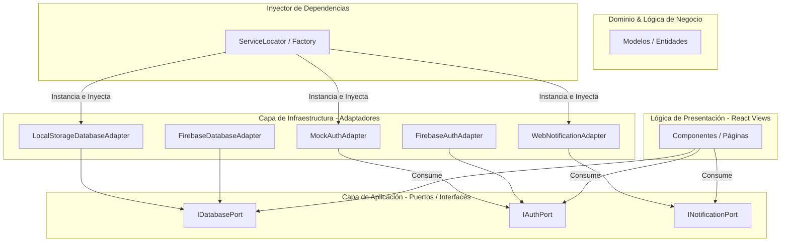

# Especificación Técnica: Clean Architecture, Puertos y Adaptadores

Este documento detalla la reestructuración de los servicios principales de **Palia** bajo principios de **Clean Architecture** (Arquitectura Hexagonal), aplicando el patrón de **Puertos y Adaptadores** e **Inyección de Dependencias (DI)**.

---

## 1. Motivación y Objetivos

*   **Desacoplamiento:** Aislar las vistas de React de los detalles tecnológicos de persistencia (LocalStorage vs. Firebase Firestore) y autenticación.
*   **Mantenibilidad:** Poder intercambiar o añadir proveedores de bases de datos o autenticación sin alterar la lógica de negocio ni las vistas.
*   **Testabilidad:** Facilitar la inyección de mocks y dobles de prueba (Test Doubles) en los tests automatizados sin alterar el código de producción.

---

## 2. Diagrama de la Arquitectura



---

## 3. Definición de Puertos (Interfaces)

### 3.1 `DatabasePort` (Puerto de Base de Datos)
Define los métodos requeridos para gestionar la persistencia clínica relacional:
*   `getPatients()`: Retorna lista de pacientes.
*   `savePatient(patient)`: Registra o actualiza un paciente.
*   `getVolunteers()`: Retorna lista de voluntarios.
*   `getHospitals()`: Retorna lista de centros médicos.
*   `saveHospital(hospital)`: Registra un hospital.
*   `getEvents()`: Retorna eventos y seguimientos clínicos.
*   `saveEvent(event)`: Registra un seguimiento clínico.
*   `assignVolunteerToPatient(patientId, volunteerId)`: Asocia un voluntario a un paciente.

### 3.2 `AuthPort` (Puerto de Autenticación)
Define los métodos para control de acceso:
*   `loginWithGoogle()`: Lanza el flujo de inicio de sesión de Google.
*   `logout()`: Cierra la sesión activa.
*   `getCurrentUser()`: Retorna la sesión del usuario autenticado.

### 3.3 `NotificationPort` (Puerto de Notificaciones)
Define la interfaz para notificaciones push:
*   `requestPermission()`: Solicita acceso al navegador o dispositivo.
*   `showNotification(title, body)`: Lanza una alerta push instantánea.

---

## 4. Estructura de Carpetas Propuesta

```
src/
├── core/                  # Capa de Aplicación y Dominio
│   ├── ports/
│   │   ├── DatabasePort.js
│   │   ├── AuthPort.js
│   │   └── NotificationPort.js
│   └── container.js       # Contenedor de Inyección de Dependencias
├── infrastructure/        # Capa de Infraestructura (Adaptadores)
│   └── adapters/
│       ├── LocalStorageDatabaseAdapter.js
│       ├── FirebaseDatabaseAdapter.js
│       ├── MockAuthAdapter.js
│       ├── FirebaseAuthAdapter.js
│       └── WebNotificationAdapter.js
```
