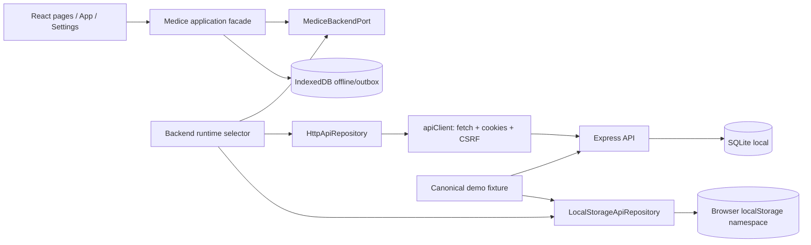

# Technical Spec: Backend local intercambiable y seed reproducible

| Campo | Valor |
|---|---|
| Status | Draft de revisión redundante (agent-c) |
| Author | Codex agent-c |
| Created | 2026-09-21 |
| Updated | 2026-09-21 |
| Product spec | [agent-c-functional-spec.md](./agent-c-functional-spec.md) |
| Related | `docs/features/api-front-separation/technical-spec.md`, `front/src/services/repositories/apiRepository.js`, `front/src/services/container.js`, `front/src/services/db.js`, `front/src/services/offlineStore.js` |

## Summary

Se agregará un puerto de aplicación estable para el dominio Medice y dos adaptadores seleccionables en runtime de desarrollo: `HttpApiRepository`, que conserva el contrato actual con Express, y `LocalStorageApiRepository`, que implementa el mismo contrato sobre un namespace local del navegador. Ambos consumirán una definición de seed versionada y determinista. El API dispondrá de una operación de carga de seed local protegida para SQLite de desarrollo/test.

La selección se resolverá desde un composition root, no desde las páginas. Configuración solo disparará el cambio de fuente y la reinicialización; no tendrá acceso directo a repositorios concretos. La API sigue siendo la única fuente habilitada en producción.

**Complexity:** Alta-media. El contrato ya existe parcialmente, pero el adapter local debe reproducir estados, reglas, mutaciones, roles, métricas y aislamiento sin introducir una segunda implementación accidentalmente divergente.

**Infrastructure (v1, proposed):** SQLite local para el seed API; persistencia de demo en `localStorage` para el adapter local; sin Turso, sin Firebase y sin sincronización entre fuentes.

## Engineering principles (applied)

| Principle | Application |
|---|---|
| Ports and adapters | La UI y `dbService` dependen de un contrato de dominio; HTTP y `localStorage` quedan en infraestructura. |
| One canonical fixture | API y frontend leen una representación común versionada del seed, con mapeo por package. |
| Server authority | El adapter local sirve solo en builds de desarrollo/demo; toda autorización productiva sigue en el API. |
| Fail closed | La selección local requiere una bandera de build explícita y no se acepta con `NODE_ENV=production`. |
| Determinism | IDs, fechas y versiones del seed son fijos; los timestamps de auditoría pueden generarse durante la operación y no forman parte de la comparación de snapshot. |
| Contract testing | La misma suite de operaciones de dominio se ejecuta contra el adapter HTTP y el local cuando el entorno lo permite. |
| Explicit capabilities | Push real, Google OAuth y sesión cookie se declaran como capacidades del adapter; el local no simula éxito silencioso. |
| Isolation | Cada fuente usa almacenamiento y estado separados; cambiar de una a otra nunca ejecuta importación implícita. |

## Architecture



### Modules

- `front/src/core/ports/MediceBackendPort.js`: contrato explícito de operaciones de dominio y capacidades.
- `front/src/infrastructure/adapters/HttpApiRepository.js`: nombre/ubicación recomendados para el adapter actual. Puede mantener un alias de compatibilidad desde `services/repositories/apiRepository.js`.
- `front/src/infrastructure/adapters/LocalStorageApiRepository.js`: persistencia local por namespace y aplicación de reglas necesarias para el modo demo.
- `front/src/services/apiClient.js`: transporte HTTP, cookies, CSRF, serialización camelCase y errores HTTP; no es el puerto de negocio.
- `front/src/services/db.js`: fachada de aplicación/estado, parametrizada con el adapter activo; no importa `apiClient` directamente.
- `front/src/services/backendRuntime.js`: composición, selección, capacidades, cambio de fuente y eventos de reconfiguración.
- `front/src/services/offlineStore.js`: IndexedDB para identidad, fichas cacheadas y outbox; permanece separada de la persistencia seed.
- `front/src/services/pushNotifications.js`: usa una dependencia de notificaciones inyectada o el adapter activo; el local informa capacidad no configurada.
- `api/src/infrastructure/seed/`: cargador de fixture para SQLite local/test, con validación de entorno y transacción.
- `fixtures/medice-demo/seed.json` (ubicación propuesta): dataset común, `schemaVersion`, metadata y entidades sintéticas.

## Port contract

El contrato debe ser asíncrono aunque el adapter local use `localStorage`, para que las páginas no conozcan la diferencia y una futura implementación Firebase pueda reemplazarlo.

```js
export const backendCapabilities = {
  authMode: 'cookie' | 'local-seed',
  supportsGoogleAuth: boolean,
  supportsPushSubscription: boolean,
  supportsOfflineOutbox: boolean,
  source: 'api' | 'local',
};

export class MediceBackendPort {
  auth = {
    me: async () => {},
    google: async (authCode) => {},
    devBypass: async (email, name) => {},
    signOut: async () => {},
  };
  bootstrap = async () => {};
  patients = {
    list: async (params) => {}, get: async (id) => {}, create: async (body) => {},
    update: async (id, body) => {}, archive: async (id) => {}, restore: async (id) => {},
    assign: async (id, volunteerIds) => {}, followUps: async (id) => {},
    createFollowUp: async (id, body) => {}, createAlert: async (id, body) => {},
  };
  alerts = { list: async (params) => {}, resolve: async (id, note) => {} };
  hospitals = {
    list: async (includeArchived) => {}, create: async (body) => {}, update: async (id, body) => {},
    archive: async (id) => {}, restore: async (id) => {},
  };
  volunteers = { list: async (query) => {}, updateProfile: async (body) => {} };
  access = { list: async () => {}, addVolunteer: async (email) => {}, remove: async (email) => {} };
  stats = { mine: async (params) => {}, global: async (params) => {} };
  push = { vapidPublicKey: async () => {}, subscribe: async (subscription) => {}, unsubscribe: async (endpoint) => {} };
}
```

El contrato real debe expresarse con JSDoc o tipos compartidos; el snippet muestra la forma, no debe quedar como una clase con métodos vacíos en producción. Las respuestas deben ser DTO de dominio sin envelopes `{ data }` ni conocimiento de status HTTP.

## Canonical seed

### Formato

Se propone un `seed.json` común con:

- `schemaVersion` entero obligatorio.
- `seedId` estable.
- `generatedFor` y descripción de demo sin secretos.
- `users`, `profiles`, `allowedUsers`, `hospitals`, `patients`, `caregivers`, `assignments`, `followUps`, `alerts`, `notifications` y relaciones necesarias.
- IDs deterministas y fechas ISO UTC fijas.
- DNI solo numérico, ficticio y único.
- Duraciones 60, 120 y una duración válida divisible por 15.

No se deben guardar contraseñas, códigos OAuth, cookies, tokens VAPID ni endpoints push reales.

### Reutilización

- El API valida el fixture y lo traduce a inserts de migraciones/tablas en una transacción SQLite.
- El frontend valida la misma versión y la traduce a la forma de lectura del adapter local.
- No se duplican manualmente dos listas de pacientes o seguimientos.
- Si el modelo API cambia, el cargador y el adapter deben rechazar una versión incompatible con un error claro.
- El fixture se puede mantener como JSON puro para evitar importar código backend en Vite y para que la paridad sea auditable.

## API seed loading

Se recomienda un comando local/test, en vez de un endpoint público:

```text
npm run db:seed:demo --prefix api
```

Requisitos del comando:

- Solo permite `NODE_ENV=development|test` y un proveedor SQLite local.
- Requiere una bandera explícita como `ALLOW_DEMO_SEED=true` o una opción equivalente de CLI.
- Hace reset únicamente del dominio Medice de la base seleccionada; no borra migraciones ni configuración accidentalmente.
- Inserta el fixture en una transacción y es repetible.
- Valida referencias, DNI, roles, estados, duraciones y fechas antes de mutar.
- Reporta conteos insertados por entidad y `seedId`.
- No permite Turso ni una URL remota como destino del seed en v1.
- No crea credenciales productivas ni cambia secretos.

Si se necesita cargar por HTTP para una demo local, debe ser una ruta separada, deshabilitada por defecto, protegida por bypass de desarrollo y cubierta por pruebas de que nunca arranca en producción.

## LocalStorageApiRepository

### Namespace y versión

- Namespace propuesto: `medice.local-backend.v1`.
- Un solo objeto versionado con entidades relacionadas o stores por entidad bajo el mismo prefijo.
- Nunca reutilizar claves legacy de pacientes ni `palia_user` como fuente productiva.
- Mantener metadata: `schemaVersion`, `seedId`, `revision`, `updatedAt` y `activeIdentityId`.
- Al detectar JSON inválido o versión incompatible, no ejecutar mutaciones parciales; ofrecer reinicializar el seed.

### Semántica

- Implementa las mismas operaciones del puerto con promesas.
- Valida campos requeridos y DNI único antes de guardar.
- Aplica roles seed para ocultar operaciones y devuelve errores de aplicación equivalentes a 401/403/404/409/422, sin simular status HTTP si la UI no lo necesita.
- Calcula estados de paciente, métricas y relaciones usando los mismos nombres canónicos que el API.
- Mantiene varias alertas activas, notas de resolución, archivo/restauración e idempotencia `clientMutationId`.
- Usa revisión optimista para edición de pacientes y devuelve conflicto si el `updatedAt` local quedó vencido.
- No implementa push real; sus métodos devuelven una capacidad no disponible o un resultado explícito de simulación, según la decisión de producto.

### Autenticación local

Para que la UI pueda probar los tres roles, el adapter necesita una identidad local de demo. La recomendación es mostrar un selector de identidades seed en la pantalla de ingreso cuando el backend local está activo, con una etiqueta inequívoca `Demo local`. No debe reutilizar el bypass de producción ni generar una cookie API.

El modo local puede iniciar directamente una identidad seleccionada, pero debe reinicializar el estado al cambiarla y mantener sus outbox/almacenamiento aislados por `userId`.

## Runtime selection and Settings

### Composition root

`services/container.js` debe dejar de exportar únicamente una instancia fija. Se propone:

```js
export const backendRuntime = createBackendRuntime({
  http: () => new HttpApiRepository(),
  local: () => new LocalStorageApiRepository({ fixture }),
  localEnabled: import.meta.env.VITE_ENABLE_LOCAL_BACKEND === 'true',
  defaultSource: import.meta.env.VITE_BACKEND_ADAPTER || 'http',
});

export const apiRepository = backendRuntime.current();
export const dbService = createDbService({ apiRepository });
```

La forma concreta debe preservar la reactividad: `dbService` necesita poder reemplazar el repository o ser recreado junto con el runtime. No se debe cambiar una variable local sin notificar a `App` y a las páginas.

### Cambiar fuente

1. Settings solicita a `backendRuntime.canSwitchTo(source)`.
2. El runtime verifica build, capacidades y outbox pendiente.
3. Muestra confirmación y advierte que los datos no se copian.
4. Cierra identidad del adapter actual.
5. Cambia el repository y reinicializa `dbService`.
6. Emite `medice:backend-changed` y `medice:data-updated`.
7. La aplicación vuelve a solicitar `me/bootstrap` o identidad local.
8. Si hay error, revierte al adapter anterior y muestra la causa.

El selector solo debe usar estado de runtime, no `localStorage` como autoridad de seguridad. Persistir la preferencia de fuente es opcional y debe resetearse a HTTP en builds productivos.

## Auth & authorization

- HTTP: conserva Google, cookie HttpOnly, CSRF, `Origin` y roles del API.
- Local: usa identidades del fixture y las mismas capacidades de rol para la UX de demo; no representa una sesión productiva.
- Las páginas no deben tomar decisiones críticas solo por el adapter: el API continúa siendo la autoridad cuando la fuente es HTTP.
- El adapter local debe marcar claramente que no hay sesión compartida ni autorización server-side.
- El selector no puede conceder admin en la API ni modificar `INITIAL_ADMIN_EMAILS`.

## Frontend integration

Refactor mínimo requerido:

- `App.jsx` y `Login.jsx` consumen el runtime/puerto, no `apiClient`.
- `offlineSync.js` recibe el adapter activo por dependencia, como ya recibe parcialmente el repository.
- `pushNotifications.js` recibe `push` del adapter/capability.
- `dbService` conserva normalización de formularios, pero recibe un repository inyectado.
- `Settings.jsx` usa un `backendRuntime` y presenta selector/carga de seed solo cuando `localEnabled` es verdadero.
- Todas las páginas continúan usando `dbService`, evitando que cada pantalla conozca el origen de datos.
- `isCloudBackend()` debe reemplazarse por `getBackendInfo()` o `capabilities`; el estado no puede asumir que toda fuente es cloud.

## Security checklist

- [ ] `VITE_ENABLE_LOCAL_BACKEND` es falso por defecto.
- [ ] El build de producción rechaza la opción local aunque alguien inyecte una preferencia del navegador.
- [ ] El API seed se bloquea en producción y nunca se dirige a Turso en este alcance.
- [ ] El fixture no contiene secretos, PII real ni tokens.
- [ ] El adapter local usa namespace aislado y no lee claves legacy operativas.
- [ ] Cambiar fuente no copia cookies, credenciales ni outbox a otro usuario/backend.
- [ ] Push local no afirma entrega real.
- [ ] La UI muestra claramente que el modo local es demo.
- [ ] Las reglas de servidor existentes siguen siendo obligatorias cuando la fuente es API.

## Environment variables

| Variable | Scope | Default | Purpose |
|---|---|---|---|
| `VITE_BACKEND_ADAPTER` | Front build local/test | `http` | Fuente inicial, solo valores permitidos `http`/`local`. |
| `VITE_ENABLE_LOCAL_BACKEND` | Front build local/test | `false` | Habilita selector y adapter local. |
| `ALLOW_DEMO_SEED` | API local/test | `false` | Habilita carga explícita del seed demo. |
| `NODE_ENV` | API/front | según entorno | Bloquea seed y adapter local en producción. |

No usar nombres `VITE_*` para secretos. El API mantiene sus variables OAuth, sesión y base existentes.

## Testing

| Layer | Scope |
|---|---|
| Fixture validation | Rechaza schemaVersion, referencias, DNI, roles, estados, fechas y duraciones inválidas. |
| Local repository unit | CRUD completo, permisos, múltiples alertas, resolución con nota, archivo/restauración, asignaciones, estadísticas e idempotencia. |
| API seed integration | Carga repetible en SQLite efímera, conteos y snapshot semántico contra el fixture. |
| Contract suite | Ejecuta las operaciones comunes contra `LocalStorageApiRepository` y `HttpApiRepository`; ignora solo capacidades justificadamente no soportadas. |
| Runtime unit | Selección inicial, bloqueo productivo, cambio con error, rollback y aislamiento de namespaces. |
| Settings component | Selector solo visible cuando está habilitado; confirmación y estado activo; carga seed con mensaje. |
| Offline unit/E2E | Outbox asociada a identidad y adapter, cambio con pendientes según política definida. |
| Playwright desktop | Recorridos seed en API y local, cambio de backend y ausencia de mezcla. |
| Playwright mobile | Settings, login local, directorio, ficha, seguimiento, alertas y estadísticas en 360×800 y 390×844; capturas revisadas visualmente. |
| Production build check | Verifica que el selector/adapter local no se inicializa y que el seed no se carga. |

## Implementation phases

| Phase | Deliverable |
|---|---|
| 1 | Confirmar decisiones abiertas de identidad local, outbox, almacenamiento y carga del seed API. |
| 2 | Definir fixture común y validator; cubrir el dataset completo. |
| 3 | Formalizar `MediceBackendPort` y separar `HttpApiRepository` del transporte. |
| 4 | Implementar `LocalStorageApiRepository` con reglas, capacidades y seed local. |
| 5 | Agregar runtime selector, reconfiguración de `dbService` y Settings. |
| 6 | Agregar carga protegida de seed SQLite local/test y pruebas de repetibilidad. |
| 7 | Ejecutar suite de contrato, E2E desktop/mobile, capturas y revisión visual. |
| 8 | Retirar caminos legacy de localStorage operativo y documentar el modo demo. |

## Acceptance mapping

| Functional criterion | Technical evidence |
|---|---|
| 1–2. Selector y bloqueo productivo | Runtime unit, production build check y Settings component. |
| 3–4. Seed local completo y determinista | Fixture validator, local repository unit y snapshots. |
| 5–6. Roles y paridad API/local | Contract suite y E2E por identidad seed. |
| 7–10. Flujos clínicos, métricas y alertas | Repository tests y Playwright seed flows. |
| 11. Aislamiento entre fuentes | Runtime integration con datasets diferenciados y prueba de no escritura cruzada. |
| 12. Capacidades no soportadas | Tests de push/local y mensajes de Settings. |
| 13. Reload idempotente | Seed reset test y comparación de snapshot semántico. |
| 14. Contrato compartido | Suite parametrizada por adapter. |
| 15. Responsive | Playwright en 360×800/390×844 y revisión de screenshots. |

## Out of scope (technical)

- Adapter Firebase.
- Turso y cualquier seed remoto.
- Migración o merge de datos locales con API.
- Push real en el adapter local.
- Sincronización entre pestañas más allá de invalidación/reload básica.
- Reemplazar el dominio API por reglas Firestore.

## Open items (minor / require product lock)

1. Confirmar si la carga API será exclusivamente comando local o también endpoint de desarrollo.
2. Confirmar selector de identidad local versus identidad demo fija.
3. Confirmar si `localStorage` es un requisito literal o si IndexedDB queda permitido para evitar límites de tamaño.
4. Confirmar si una outbox local pendiente bloquea cambio de fuente o queda separada por source/user.
5. Confirmar si el seed API debe preservar usuarios/RBAC preexistentes o resetear también usuarios sintéticos en SQLite local.
