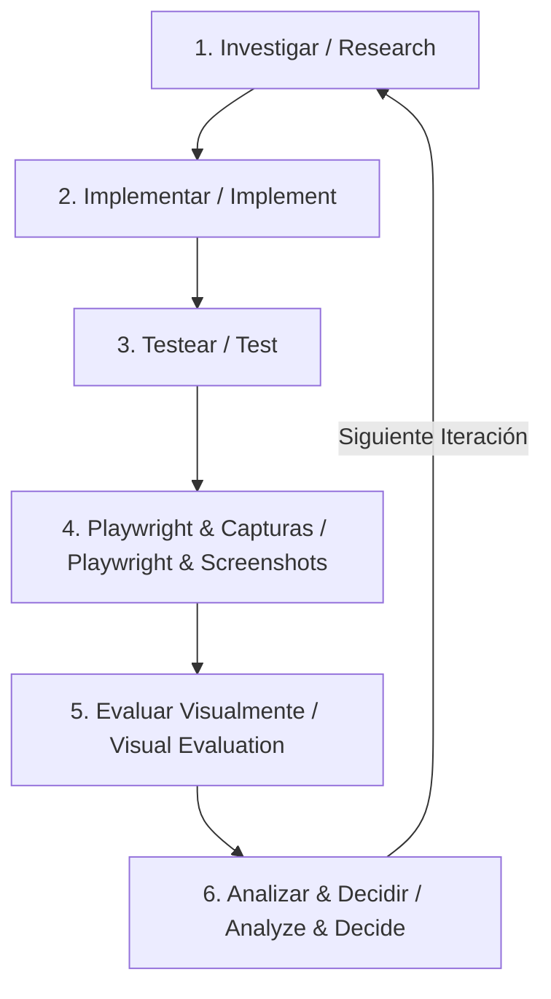

# **Implementation Plan - Medice Care Connect Application**

We will build the **Medice Care Connect** (PaliativoCare) web application as a single-page React app using Vite, utilizing Vanilla CSS for maximum flexibility and absolute adherence to the custom *Serenity & Clarity* design guidelines. 

To keep infrastructure cost at absolute zero ($0 USD), the app will implement a clean Data Access Object (DAO) pattern in a database service layer. By default, it will persist all data (patients, caregivers, follow-ups, hospitals, volunteers) to `localStorage` (acting as a local relational database). This enables immediate, fully-functional offline testing out-of-the-box. We will also write the setup and configuration files for Firestore so the organization can easily activate it when ready.

---

## **Golden Rule of Engineering: The Loop**

Every iteration of this project MUST strictly follow the Loop engineering process below. No changes will be considered complete until they have traversed all steps of the Loop:

1.  **Investigar (Research):** Review requirements, inspect existing mock HTML files, and check dependencies and configurations before writing code.
2.  **Implementar (Implement):** Write modular, high-quality React components and Vanilla CSS properties file-by-file.
3.  **Testear (Test):** Run build verification (`npm run build`) and test server verification (`npm run dev`) to catch syntax, import, or typing errors.
4.  **Playwright & Visual Capture (Playwright & Capturas):** Write automated browser test scripts in Playwright that navigate through the flows (Dashboard, Patient registration, Follow-up registration, etc.) and save page screenshots to the artifacts folder.
5.  **Evaluar Visualmente (Visual Evaluation):** Open and inspect the screenshots to evaluate visual fidelity, color harmony, typography (Inter), padding/gutters, and mobile-desktop layout adaptiveness.
6.  **Analizar y Decidir (Analyze & Decide):** Identify bugs, visual misalignment, or gaps in user stories, and formulate the plan for the next iteration loop.

---

## **User Review Required**

> [!IMPORTANT]
> **Database Integration Strategy:** The database adapter service (`src/services/db.js`) is designed to run in `localStorage` mode by default. Once the NGO completes their registration, they can toggle `USE_FIREBASE = true` in the configuration and supply their Firebase Keys. No code changes will be required in the components.
>
> **Styling Method:** Vanilla CSS variables are used in `src/index.css` for primary/secondary teals, sage greens, accessibility-compliant font sizes (minimum 16px for body), and touch target hit boxes (minimum 44x44px).

---

## **Proposed Changes**

### **Configuration & Entry Points**

#### [MODIFY] [index.html](file:///e:/Documents/Proyectos/medice-app/index.html)
- Add standard responsive meta tags.
- Load Google Fonts (Inter) and Material Symbols Outlined icons.
- Update page title to `Medice Care Connect`.

#### [NEW] [db.js](file:///e:/Documents/Proyectos/medice-app/src/services/db.js)
- Build a unified database interface.
- Implement seed data for mock testing (e.g. Manuel Segovia, Elena Gutiérrez, Ricardo Mendoza, Marta Rodríguez, hospitals, and follow-ups).
- Provide functions: `getPatients()`, `getPatient(id)`, `savePatient(patient)`, `getFollowUps(patientId)`, `saveFollowUp(followUp)`, `getVolunteers()`, `saveVolunteer(volunteer)`, `getHospitals()`, `saveHospital(hospital)`, `deleteHospital(id)`.
- Enforce relational operations (e.g., updating a patient status to `Alerta` when a critical follow-up is saved).

---

### **Component Architecture**

#### [NEW] [Sidebar.jsx](file:///e:/Documents/Proyectos/medice-app/src/components/Sidebar.jsx)
- Vertical desktop navigation bar.
- Highlights the current active view.
- Provides branding (PaliativoCare) and quick log-out option.

#### [NEW] [Header.jsx](file:///e:/Documents/Proyectos/medice-app/src/components/Header.jsx)
- Top horizontal navigation bar.
- Shows search bar, notification indicators, help links, and user admin avatar.

---

### **Page Views**

#### [NEW] [Dashboard.jsx](file:///e:/Documents/Proyectos/medice-app/src/pages/Dashboard.jsx)
- Renders the weekly summary statistics (visits, volunteers, hours).
- Visualizes a CSS-based weekly visit chart.
- Displays urgent Alert banners (e.g. Elena Gutiérrez) with quick-action links.
- Lists pending visits.
- Renders the patient grid showing status badges (Estable, En Observación, Alerta).
- Features a Floating Action Button (FAB) to trigger a new follow-up.

#### [NEW] [Patients.jsx](file:///e:/Documents/Proyectos/medice-app/src/pages/Patients.jsx)
- Complete directory of patients.
- Includes a search bar and a quick filter by status.
- Shows key patient cards with action buttons ("Ver Ficha", "Nuevo Seguimiento").

#### [NEW] [PatientDetail.jsx](file:///e:/Documents/Proyectos/medice-app/src/pages/PatientDetail.jsx)
- Renders full profile details (DNI, diagnosis, hospital, age).
- Displays Caregiver details card (phone, lives with patient, caregiver burden level).
- Chronological timeline of all past follow-up visits (*Seguimientos*), with special visual warnings for historical alert states.

#### [NEW] [NewPatient.jsx](file:///e:/Documents/Proyectos/medice-app/src/pages/NewPatient.jsx)
- Multi-section bento grid form to register a new patient.
- Input validation for personal details (name, DOB, address), clinical details (diagnosis, hospital list selection, status), and primary caregiver information.

#### [NEW] [NewFollowUp.jsx](file:///e:/Documents/Proyectos/medice-app/src/pages/NewFollowUp.jsx)
- Intake form for visit report.
- Features selectors for symptom scales (Dolor scale 0-10, Nausea level, Dyspnea scale).
- Input checkmarks for equipment requirements (Oxygen, bed, secretor).
- Support risk levels radio buttons.
- Features the **Alerta toggle** to instantly activate critical warning flags.

#### [NEW] [Volunteers.jsx](file:///e:/Documents/Proyectos/medice-app/src/pages/Volunteers.jsx)
- Directory card-grid of active volunteers (names, tenure, assigned patients count).
- Search bar and filter tabs.

#### [NEW] [Stats.jsx](file:///e:/Documents/Proyectos/medice-app/src/pages/Stats.jsx)
- Aggregated impact statistics page.
- Visual monthly hours bar chart.
- Personal milestone cards.
- Historic logs table.

#### [NEW] [Admin.jsx](file:///e:/Documents/Proyectos/medice-app/src/pages/Admin.jsx)
- Management panel.
- Allows assigning/unassigning volunteers to patient files.
- Provides CRUD controls to manage the Hospital master catalog.

---

### **Core Shell & Styling**

#### [MODIFY] [App.jsx](file:///e:/Documents/Proyectos/medice-app/src/App.jsx)
- Handles global state (active navigation tab, selected patient ID for detail views).
- Handles responsive toggle for mobile views.
- Integrates the global dashboard alerts banner dynamically.

#### [MODIFY] [index.css](file:///e:/Documents/Proyectos/medice-app/src/index.css)
- Implement full *Serenity & Clarity* design tokens.
- Write responsive grid styles, card styles, form inputs, button states, bento grids, and timeline layouts in Vanilla CSS.

---

## **Verification Plan**

### **Automated Verification**
- Run `npm install` and verify dependencies.
- Build the production bundle using `npm run build` to ensure there are no compilation or syntax errors.

### **Manual Verification & Loop Steps**
1. Run local dev server (`npm run dev`) and test responsiveness on mobile and desktop layout.
2. Register a new patient and confirm they appear in the patient directory.
3. Assign a volunteer to a patient inside the Admin panel.
4. Add a new follow-up report for a patient, toggle **Alerta**, and verify that the global critical alert banner triggers and the patient moves to the top of the list in "Alerta" status.
5. Add a hospital, modify it, and verify that the select option updates in the patient form.
6. Verify persistence by refreshing the browser tab and checking if modified data remains saved.
