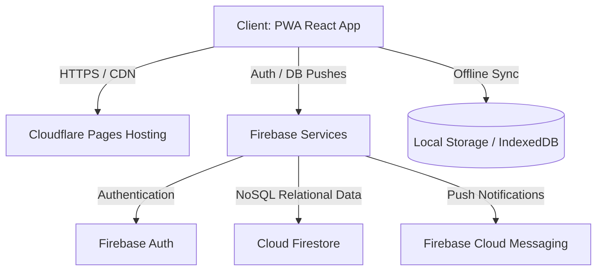
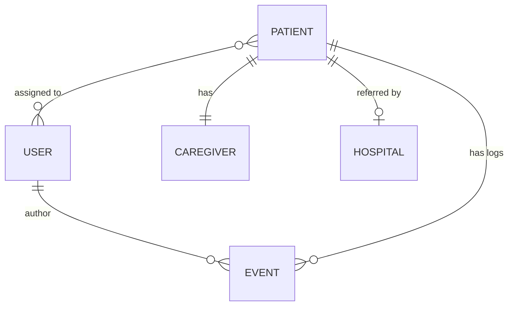

# **Technical Specification Document (TSD)**

## **Project: Medice Patient & Volunteer Management App**

**Organization:** Medice (Buenos Aires, Argentina)  
**Target Platform:** PWA (React + Vite + Vanilla CSS)  
**Infrastructure Strategy:** Serverless BaaS (Firebase) + Static CDN (Cloudflare Pages)

---

### **1. Technology Stack & Hosting Architecture**

To achieve a **permanent zero-cost infrastructure** while ensuring reliability, security, and low latency for users in Argentina, the application is designed around a serverless, decentralized architecture.



#### **1.1. Component Stack**
*   **Build Tool & Frontend Core:** Vite + React (JavaScript ES6+).
*   **Styling:** Vanilla CSS following the custom *Serenity & Clarity* design system. No TailwindCSS is used to maintain absolute styling control and minimal dependency overhead.
*   **Database & Backend Services (BaaS):** Firebase (Firestore, Auth, and Cloud Messaging).
*   **Offline Persistence:** Service Workers (PWA) + LocalStorage/IndexedDB queue for offline-first follow-up (*Seguimiento*) forms.

#### **1.2. Hosting Platform Selection: Cloudflare Pages**
*   **Why Cloudflare Pages:**
    *   **Unlimited Bandwidth:** Netlify and Vercel have bandwidth limits on their free tiers (100GB/month) and Vercel prohibits commercial/NGO fundraising use on their Hobby plan. Cloudflare Pages offers unlimited bandwidth for free.
    *   **Edge Network Performance:** Extreme speed and low latency in Argentina (served from local South American edge nodes).
    *   **Custom Domains:** Supports binding a custom `.org.ar` domain for free with SSL automatically managed.
    *   **Seamless CI/CD:** Auto-deploys on every git commit.

---

### **2. Database Schema & Relational Mapping (Cloud Firestore)**

Firestore is a NoSQL Document database. To represent relational data (such as assignments and caregiver links) efficiently, we structure it with sub-collections, references, and denormalized indexes.

#### **2.1. Entity Relationship Mapping**


#### **2.2. Collections Structure**

##### **`users` (Collection)**
```json
{
  "id": "auth_user_uid_12345",
  "name": "Marta Rodríguez",
  "email": "marta.rodriguez@medice.org.ar",
  "role": "volunteer", // "volunteer" | "admin"
  "joinedDate": "2024-03-15T12:00:00Z",
  "assignedPatients": ["pat_9988", "pat_7732"]
}
```

##### **`patients` (Collection)**
```json
{
  "id": "pat_9988",
  "name": "Ricardo Mendoza S.",
  "dni": "45.281.902-K",
  "dob": "1952-04-14",
  "address": "Calle Falsa 123, Bernal Oeste, Quilmes, GBA",
  "diagnosis": "Carcinoma bronquial avanzado con metástasis óseas.",
  "hospitalId": "hosp_001",
  "currentStatus": "Alerta", // "Estable" | "En Observación" | "Alerta"
  "assignedVolunteers": ["auth_user_uid_12345"],
  "createdAt": "2026-06-01T10:00:00Z"
}
```

##### **`caregivers` (Collection / Document mapped to Patient ID)**
*Note: Keyed by the same Patient ID to enforce a 1:1 relationship.*
```json
{
  "patientId": "pat_9988",
  "name": "Elena Mendoza R.",
  "relation": "Hija",
  "phone": "+56982341109",
  "livesWithPatient": true,
  "burdenLevel": "Bajo" // "Bajo" | "Moderado" | "Alto"
}
```

##### **`hospitals` (Collection)**
```json
{
  "id": "hosp_001",
  "name": "Hospital Dr. Sótero del Río",
  "address": "Av. Concha y Toro 3459",
  "zone": "Zona Sur"
}
```

##### **`events` (Collection - Seguimientos)**
```json
{
  "id": "ev_7788",
  "patientId": "pat_9988",
  "authorId": "auth_user_uid_12345",
  "authorName": "Marta Rodríguez",
  "date": "2026-06-30T16:45:00-03:00",
  "contactType": "Presencial", // "Presencial" | "Remoto"
  "symptoms": {
    "pain": "4-6 - Moderado", // "0 - Ausente" | "1-3 - Leve" | "4-6 - Moderado" | "7-9 - Severo" | "10 - Insoportable"
    "nausea": "Ninguno", // "Ninguno" | "Ocasional" | "Frecuente" | "Persistente"
    "dyspnea": "Grado 1 - Leve" // "Grado 0 - Normal" | "Grado 1 - Leve" | "Grado 2 - Moderada" | "Grado 3 - Severa"
  },
  "symptomObservations": "Se observa al paciente tranquilo. Control de dolor efectivo con medicación actual.",
  "socialRisk": {
    "familySupport": "Sólido y constante", // "Sólido y constante" | "Intermitente / Fragilidad" | "Ausente / Riesgo Crítico"
    "environmentNotes": "Elena comenta que ha podido descansar mejor estas últimas noches."
  },
  "equipmentNeeds": ["Cama Articulada"], // "Concentrador Oxígeno", "Cama Articulada", "Colchón Antiescaras", "Aspirador Secreciones", etc.
  "equipmentOther": "",
  "interventions": "Se refuerzan ejercicios de movilidad suave.",
  "alertActivated": false
}
```

---

### **3. Offline-First PWA Synchronization Strategy**

Palliative care visits often occur in hospitals or remote areas with poor mobile signal.

#### **3.1. Local Persistence Layer**
*   **Vite PWA Plugin (`vite-plugin-pwa`):** Configures Workbox to cache static assets (HTML, CSS, JS, Fonts, Material Icons) for complete offline boot capability.
*   **Database Cache:** Firebase Firestore is configured with offline persistence enabled:
    ```javascript
    import { initializeFirestore, persistentLocalCache, persistentMultipleTabManager } from "firebase/firestore";
    const db = initializeFirestore(app, {
      localCache: persistentLocalCache({
        tabManager: persistentMultipleTabManager()
      })
    });
    ```
*   **Write Queue (Local Storage fallback):** When creating a `Seguimiento` offline:
    1.  The app checks `navigator.onLine`.
    2.  If offline, the form payload is validated and saved into a local `localStorage` queue array (`medice_pending_sync`).
    3.  A visual banner notifies the volunteer: *"Sin conexión. Su seguimiento se ha guardado de forma local y se sincronizará automáticamente cuando vuelva la señal."*
    4.  An event listener on the window `online` event automatically reads the queue and posts each record back to Firestore, notifying the user when complete.

---

### **4. "Alerta Crítica" System & Push Notifications**

A primary requirement is immediate alerting when a volunteer logs a critical symptom or triggers the Alert toggle.

#### **4.1. Alert Trigger Logic**
1.  **State Change:** When saving a `Seguimiento` with `alertActivated: true` or a `Distress Score` of 10, the database triggers a state update on the `patient` document: `currentStatus: "Alerta"`.
2.  **Dashboard Highlight:** A Firestore `onSnapshot` listener on the client updates the main dashboard in real-time. Any patient in `Alerta` status immediately renders at the top of the patient grid with a red pulsing border and a banner alert.

#### **4.2. Push Notifications (FCM Integration)**
*   Firebase Cloud Messaging (FCM) is registered in the service worker (`firebase-messaging-sw.js`).
*   Upon login, volunteers subscribe to the patient-specific topics or general alert topics.
*   When a patient's status changes to `Alerta`, a Firestore cloud function (or client-side API trigger using a lightweight serverless call) fires an FCM notification payload:
    ```json
    {
      "message": {
        "topic": "alerts_general",
        "notification": {
          "title": "🔴 ALERTA DE CRITICAL CARE",
          "body": "El paciente Ricardo Mendoza S. requiere atención. Reporte: Crisis de dolor irruptivo."
        },
        "webpush": {
          "headers": {
            "Urgency": "high"
          }
        }
      }
    }
    ```

---

### **5. Design System Implementation (Vanilla CSS)**

All styling variables are declared in `src/index.css` following the *Serenity & Clarity* design guidelines.

```css
:root {
  /* Surface Tiers */
  --color-background: #f8f9ff;
  --color-surface: #f8f9ff;
  --color-surface-dim: #ccdbf4;
  --color-surface-container-lowest: #ffffff;
  --color-surface-container-low: #eff4ff;
  --color-surface-container: #e6eeff;
  --color-surface-container-high: #dde9ff;
  --color-surface-container-highest: #d5e3fd;
  
  /* Brand Tones */
  --color-primary: #005a71;
  --color-on-primary: #ffffff;
  --color-primary-container: #0e7490;
  --color-on-primary-container: #d3f1ff;
  --color-secondary: #4b6450;
  --color-on-secondary: #ffffff;
  --color-secondary-container: #cdead0;
  --color-on-secondary-container: #516a55;
  
  /* Alert / Urgency */
  --color-error: #ba1a1a;
  --color-on-error: #ffffff;
  --color-error-container: #ffdad6;
  --color-on-error-container: #93000a;
  
  /* Neutrals & Outlines */
  --color-on-surface: #0d1c2f;
  --color-on-surface-variant: #3f484c;
  --color-outline: #6f787d;
  --color-outline-variant: #bec8cd;

  /* Typography Scale */
  --font-family: 'Inter', sans-serif;
  --fs-headline-lg: 32px;
  --fs-headline-md: 24px;
  --fs-headline-sm: 20px;
  --fs-body-lg: 18px;
  --fs-body-md: 16px;
  --fs-label-lg: 16px;
  --fs-label-md: 14px;
  
  /* Layout Metrics */
  --border-radius-sm: 0.25rem;
  --border-radius-md: 0.5rem;
  --border-radius-lg: 0.75rem;
  --border-radius-xl: 1.5rem;
  --touch-target-min: 44px;
  --spacing-gutter: 24px;
}
```

---

### **6. Deployment & NGO Grants (Argentina Context)**

#### **6.1. Official NGO Domain (.org.ar)**
*   **NIC Argentina Setup:** Official domains for non-profits under `.org.ar` cost $8.500 ARS per year (current 2026 pricing guidelines).
*   **Procedure:** Must be registered by a legal representative of the NGO using their CUIT and Clave Fiscal Level 3 via AFIP (Trámites a Distancia - TAD).
*   **DNS Resolution:** Cloudflare Nameservers will be configured inside NIC Argentina portal for DNS resolution.

#### **6.2. TechSoup Argentina technology grants**
*   **Registration:** Register the organization on TechSoup Argentina (powered by RACI - Red Argentina de Cooperación Internacional).
*   **Validation:** NGO must submit its Personería Jurídica, Estatuto Social, and CUIT certificates.
*   **Azure Grant:** Once validated, Medice gains access to the **Microsoft Azure NGO Grant** of **$2.000 USD per year** in cloud infrastructure credits.
*   **Alternative DigitalOcean equivalent:** The Azure credits allow running an Azure virtual machine with Docker, running all services in containers exactly like DigitalOcean but at $0 total cost. 
*   *Note: For the current Vite + Firebase setup, the Firebase free tier combined with Cloudflare Pages free tier is more than sufficient and requires zero maintenance, making it the recommended primary path.*
